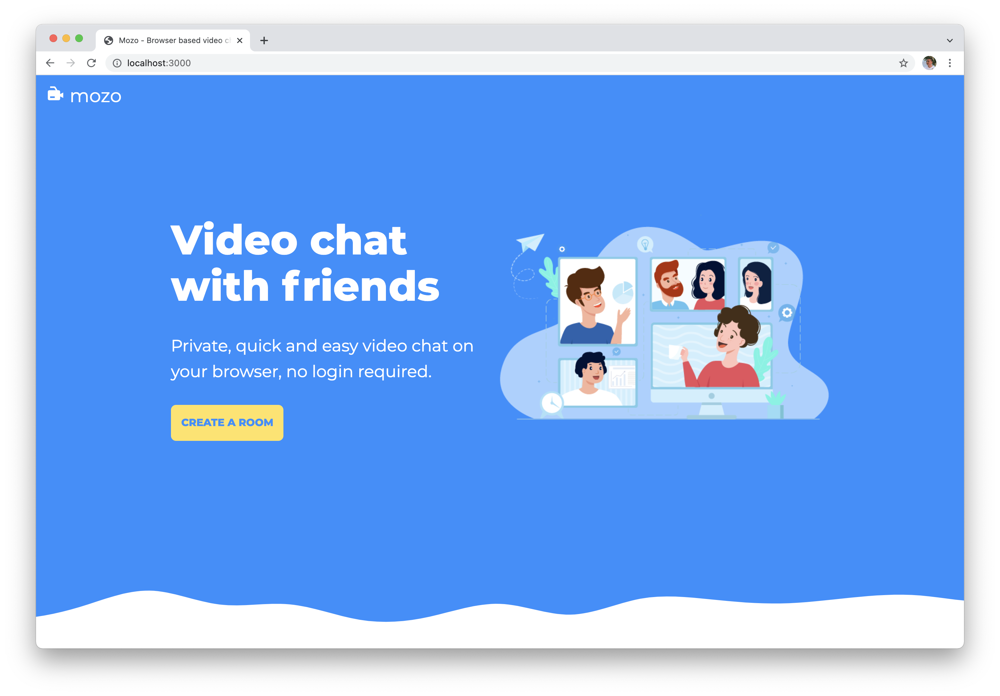

# Mozo the video chat app

Mozo is a real-time video conferencing and chat application that allows you to share your webcam, speaker and screen with other people in the chat room.

[Live demo](https://mozoapp.herokuapp.com/) 

## Goal of this Project
I got interested with WebSockets and built a simple chat app (https://github.com/jeffdelara/chatapp). Mozo is an upgrade from that knowledge using WebSockets for chat together with WebRTC for the video conferencing.
## Tech Stack
The project is created with the following tech stack: 
- HTML/CSS and Javascript
- NodeJS with Express
- WebRTC
- SocketIO
- Heroku

## Features: 
- Share webcam video
- Share speaker audio/microphone
- Chat feature
- Share screen feature

## Todo (Work in Progress): 
- Create an End Screenshare button because on Safari, there is no end screenshare 
